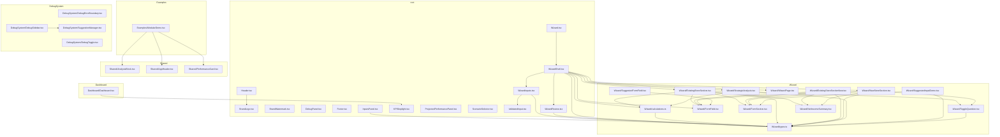

# Components Dependency Graph
Path: /docs/architecture

Purpose: Visual map of component imports within src/components (generated).

```mermaid
flowchart TD
  subgraph root[root]
    BrandLogo_tsx["BrandLogo.tsx"]
    BrandWatermark_tsx["BrandWatermark.tsx"]
    DebugPanel_tsx["DebugPanel.tsx"]
    Footer_tsx["Footer.tsx"]
    Header_tsx["Header.tsx"]
    InputsPanel_tsx["InputsPanel.tsx"]
    KPIStoplight_tsx["KPIStoplight.tsx"]
    ProjectedPerformancePanel_tsx["ProjectedPerformancePanel.tsx"]
    ScenarioSelector_tsx["ScenarioSelector.tsx"]
    ValidatedInput_tsx["ValidatedInput.tsx"]
    Wizard_tsx["Wizard.tsx"]
    WizardShell_tsx["WizardShell.tsx"]
    WizardInputs_tsx["WizardInputs.tsx"]
    WizardReview_tsx["WizardReview.tsx"]
  end
  subgraph Wizard[Wizard]
    Wizard/types_ts["Wizard/types.ts"]
    Wizard/calculations_ts["Wizard/calculations.ts"]
    Wizard/NewStoreSection_tsx["Wizard/NewStoreSection.tsx"]
    Wizard/ExistingStoreSection_tsx["Wizard/ExistingStoreSection.tsx"]
    Wizard/StrategicAnalysis_tsx["Wizard/StrategicAnalysis.tsx"]
    Wizard/WizardPage_tsx["Wizard/WizardPage.tsx"]
    Wizard/FormField_tsx["Wizard/FormField.tsx"]
    Wizard/FormSection_tsx["Wizard/FormSection.tsx"]
    Wizard/ToggleQuestion_tsx["Wizard/ToggleQuestion.tsx"]
    Wizard/NetIncomeSummary_tsx["Wizard/NetIncomeSummary.tsx"]
    Wizard/ExistingStoreSectionNew_tsx["Wizard/ExistingStoreSectionNew.tsx"]
    Wizard/SuggestedFormField_tsx["Wizard/SuggestedFormField.tsx"]
    Wizard/SuggestedInputDemo_tsx["Wizard/SuggestedInputDemo.tsx"]
  end
  subgraph Shared[Shared]
    Shared/AnalysisBlock_tsx["Shared/AnalysisBlock.tsx"]
    Shared/AppHeader_tsx["Shared/AppHeader.tsx"]
    Shared/PerformanceCard_tsx["Shared/PerformanceCard.tsx"]
  end
  subgraph Examples[Examples]
    Examples/ModularDemo_tsx["Examples/ModularDemo.tsx"]
  end
  subgraph DebugSystem[DebugSystem]
    DebugSystem/DebugErrorBoundary_tsx["DebugSystem/DebugErrorBoundary.tsx"]
    DebugSystem/DebugSidebar_tsx["DebugSystem/DebugSidebar.tsx"]
    DebugSystem/SuggestionManager_tsx["DebugSystem/SuggestionManager.tsx"]
    DebugSystem/DebugToggle_tsx["DebugSystem/DebugToggle.tsx"]
  end
  subgraph Dashboard[Dashboard]
    Dashboard/Dashboard_tsx["Dashboard/Dashboard.tsx"]
  end
  Header_tsx --> BrandLogo_tsx
  InputsPanel_tsx --> Wizard/types_ts
  Wizard_tsx --> WizardShell_tsx
  WizardInputs_tsx --> Wizard/types_ts
  WizardInputs_tsx --> ValidatedInput_tsx
  WizardReview_tsx --> Wizard/types_ts
  WizardShell_tsx --> Wizard/types_ts
  WizardShell_tsx --> Wizard/calculations_ts
  WizardShell_tsx --> WizardInputs_tsx
  WizardShell_tsx --> WizardReview_tsx
  WizardShell_tsx --> Wizard/NewStoreSection_tsx
  WizardShell_tsx --> Wizard/ExistingStoreSection_tsx
  WizardShell_tsx --> Wizard/StrategicAnalysis_tsx
  WizardShell_tsx --> Wizard/WizardPage_tsx
  WizardShell_tsx --> Wizard/FormField_tsx
  Wizard/calculations_ts --> Wizard/types_ts
  Wizard/ExistingStoreSection_tsx --> Wizard/types_ts
  Wizard/ExistingStoreSection_tsx --> Wizard/calculations_ts
  Wizard/ExistingStoreSection_tsx --> Wizard/FormSection_tsx
  Wizard/ExistingStoreSection_tsx --> Wizard/FormField_tsx
  Wizard/ExistingStoreSection_tsx --> Wizard/ToggleQuestion_tsx
  Wizard/ExistingStoreSection_tsx --> Wizard/NetIncomeSummary_tsx
  Wizard/ExistingStoreSectionNew_tsx --> Wizard/types_ts
  Wizard/ExistingStoreSectionNew_tsx --> Wizard/FormSection_tsx
  Wizard/ExistingStoreSectionNew_tsx --> Wizard/FormField_tsx
  Wizard/ExistingStoreSectionNew_tsx --> Wizard/NetIncomeSummary_tsx
  Wizard/NewStoreSection_tsx --> Wizard/types_ts
  Wizard/NewStoreSection_tsx --> Wizard/FormSection_tsx
  Wizard/NewStoreSection_tsx --> Wizard/FormField_tsx
  Wizard/NewStoreSection_tsx --> Wizard/ToggleQuestion_tsx
  Wizard/NewStoreSection_tsx --> Wizard/NetIncomeSummary_tsx
  Wizard/StrategicAnalysis_tsx --> Wizard/types_ts
  Wizard/StrategicAnalysis_tsx --> Wizard/calculations_ts
  Wizard/SuggestedFormField_tsx --> Wizard/FormField_tsx
  Wizard/SuggestedInputDemo_tsx --> Wizard/types_ts
  Wizard/SuggestedInputDemo_tsx --> Wizard/FormSection_tsx
  Wizard/ToggleQuestion_tsx --> Wizard/types_ts
  Examples/ModularDemo_tsx --> Shared/AppHeader_tsx
  Examples/ModularDemo_tsx --> Shared/AnalysisBlock_tsx
  Examples/ModularDemo_tsx --> Shared/PerformanceCard_tsx
  DebugSystem/DebugSidebar_tsx --> DebugSystem/SuggestionManager_tsx
  Dashboard/Dashboard_tsx --> KPIStoplight_tsx
```
