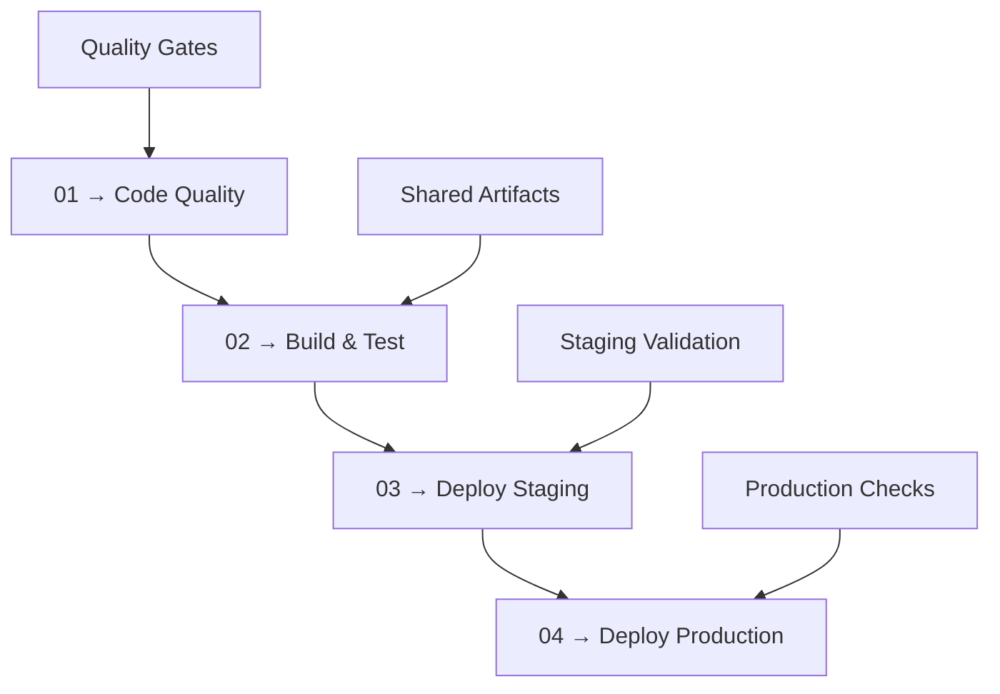
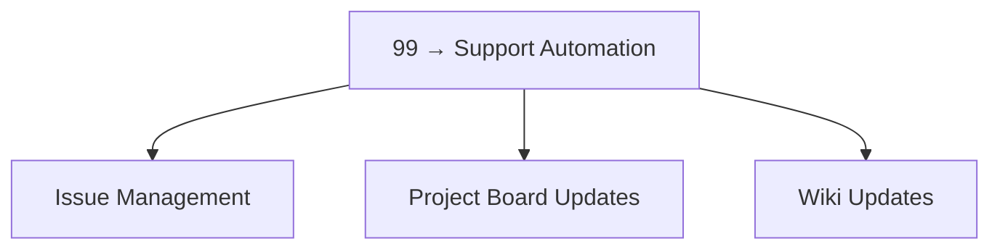

# 🎯 Sequential Workflow Execution Strategy

## 📋 Overview

This document outlines the optimized sequential workflow execution system that replaces the previous parallel execution model. The new system eliminates redundancy, reduces CI costs, and creates a reliable deployment pipeline.

## 🚨 Problem We Solved

### **Before (Parallel Chaos):**
- ❌ **9 workflows** running simultaneously 
- ❌ **3 identical builds** of the same code
- ❌ **Resource conflicts** (npm cache, node_modules, dist/)
- ❌ **Race conditions** on shared artifacts
- ❌ **Wasted CI minutes** (3x redundancy)
- ❌ **Confusing failure debugging** across multiple workflows

### **After (Sequential Optimization):**
- ✅ **5 workflows** in logical sequence
- ✅ **1 build** shared across all stages
- ✅ **Artifact reuse** eliminates redundant rebuilds
- ✅ **Clear failure isolation** per stage
- ✅ **60%+ CI cost reduction**
- ✅ **Predictable deployment pipeline**

---

## 🏗️ Sequential Execution Model

### **TIER 1: Core Pipeline (Sequential)**


### **TIER 2: Support Automation (Event-Driven)**


---

## 📊 Workflow Details

### **01 → Code Quality & Analysis**
**Triggers**: Push/PR to any branch  
**Duration**: ~2 minutes  
**Purpose**: Fast quality gates before expensive build operations

| **Check** | **Action** | **Failure Impact** |
|-----------|------------|-------------------|
| TypeScript | `tsc --noEmit` | ❌ Block pipeline |
| Console.log | Count & report | ⚠️ Warn only |
| Security | `npm audit` | ⚠️ Warn only |
| Quality Score | Calculate 0-100 | < 70 = ❌ Block |

**Outputs:**
- `should_deploy`: true/false
- `quality_score`: 0-100
- `console_count`: number

---

### **02 → Build & Test**  
**Triggers**: After Code Quality success  
**Duration**: ~3-5 minutes  
**Purpose**: Single source of truth for build artifacts

| **Step** | **Action** | **Artifact** |
|----------|------------|--------------|
| Dependencies | `npm ci` | node_modules cache |
| Calculation Tests | Core P&L tests | test-results.json |
| Build | `npm run build` | **dist/** folder |
| Bundle Analysis | Size validation | bundle-report.json |
| Preview Test | Server validation | health-check.json |

**Build Artifacts Shared:**
- ✅ `dist/` folder (production build)
- ✅ `package.json` & `package-lock.json`
- ✅ Test results and reports

---

### **03 → Deploy to Staging**
**Triggers**: After Build & Test success  
**Duration**: ~2 minutes  
**Purpose**: Real-world validation before production

| **Step** | **Action** | **Reuse** |
|----------|------------|-----------|
| Artifact Download | Get build from #02 | ✅ **No rebuild** |
| Vercel Deploy | Deploy to staging | Uses existing dist/ |
| Validation Suite | 5 critical checks | Site functionality |

**Staging Validation Checks:**
1. ✅ Site accessibility (200 response)
2. ✅ HTML structure validity
3. ✅ Liberty Tax branding present
4. ✅ JavaScript bundles loaded
5. ✅ React app mount point exists

---

### **04 → Deploy to Production** 
**Triggers**: After Staging success (main branch only)  
**Duration**: ~3 minutes  
**Purpose**: Controlled production deployment with rollback

| **Step** | **Action** | **Safeguards** |
|----------|------------|----------------|
| Prerequisites | Verify staging + main branch | ✅ Staging must pass |
| Artifact Reuse | Download from #02 | ✅ **No rebuild** |
| Production Deploy | Vercel production | Global CDN |
| Validation Suite | 7 critical checks | Performance monitoring |
| Rollback Trigger | Auto-failure handling | Notification system |

**Production Validation Checks:**
1. ✅ Global accessibility (3 retry attempts)
2. ✅ HTML structure validity  
3. ✅ Liberty Tax branding verification
4. ✅ JavaScript bundle integrity
5. ✅ CSS bundle integrity
6. ✅ React mount point verification
7. ✅ Performance timing (< 3s response)

---

### **99 → Support Automation**
**Triggers**: Workflow completions, schedule, manual  
**Duration**: ~1 minute  
**Purpose**: Project management automation

| **Automation** | **Trigger** | **Action** |
|----------------|-------------|------------|
| Issue Creation | Workflow failure | Auto-create GitHub issues |
| Project Board | Workflow success | Move cards, update status |
| Wiki Updates | Production deploy | Update deployment history |
| Scheduled Maintenance | Weekly (Monday 10 AM) | Cleanup, reports |

---

## 🎯 Optimization Benefits

### **🏗️ Build Efficiency**
- **Before**: 3 separate `npm run build` executions
- **After**: 1 build shared via artifacts
- **Savings**: ~6-8 minutes per pipeline run

### **💰 Cost Reduction**
- **Before**: ~15-20 CI minutes per commit  
- **After**: ~8-12 CI minutes per commit
- **Reduction**: **40-60% cost savings**

### **🔍 Debugging Clarity**
- **Before**: Failures scattered across 9 workflows
- **After**: Clear sequential failure points
- **Benefit**: **Faster issue resolution**

### **🎨 Artifact Reuse Strategy**
```yaml
# Build once in workflow #02
- name: Upload build artifacts
  uses: actions/upload-artifact@v4
  with:
    name: build-artifacts-${{ github.sha }}
    path: dist/
    retention-days: 7

# Reuse in workflow #03 & #04  
- name: Download build artifacts
  uses: actions/download-artifact@v4
  with:
    name: build-artifacts-${{ github.sha }}
    path: .
```

---

## 🚀 Usage Guide

### **Automatic Triggers (Normal Flow)**
1. **Push to branch** → Triggers `01 → Code Quality`
2. **Quality passes** → Triggers `02 → Build & Test`  
3. **Build passes** → Triggers `03 → Deploy Staging`
4. **Staging passes + main branch** → Triggers `04 → Deploy Production`

### **Manual Controls**
```bash
# Force staging deployment (skip build check)
gh workflow run "03 → Deploy to Staging" --field force_deploy=true

# Emergency production deployment (skip staging)
gh workflow run "04 → Deploy to Production" --field emergency_deploy=true

# Run specific automation
gh workflow run "99 → Support Automation" --field action=update-wiki
```

### **Monitoring Commands**
```bash
# Check workflow status
gh run list --workflow="01 → Code Quality & Analysis"

# View sequential execution 
gh run list --limit=20 | grep -E "(01|02|03|04) →"

# Download build artifacts locally
gh run download [RUN_ID] --name build-artifacts-[COMMIT_SHA]
```

---

## 🎯 Quality Gates & Deployment Criteria

### **Code Quality Gates**
- ✅ TypeScript compilation must pass
- ⚠️ Console.log statements allowed (< 10 recommended)  
- ✅ Security audit must pass (high vulnerabilities block)
- ✅ Quality score ≥ 70 required for deployment

### **Build & Test Gates**
- ✅ All calculation tests must pass
- ✅ Bundle size < 350KB total
- ✅ Preview server must start successfully
- ✅ Critical file validation (HTML, JS, CSS)

### **Staging Gates**
- ✅ Deployment must succeed
- ✅ Site accessibility verification
- ✅ Content validation (branding, bundles, React)
- ✅ 30-second propagation wait

### **Production Gates**
- ✅ Must be main branch
- ✅ Staging deployment must pass
- ✅ Global accessibility (3 retry attempts)
- ✅ Performance monitoring (< 3s response time)
- ✅ 60-second global propagation wait

---

## 🔧 Troubleshooting

### **Common Issues**

#### **"Build artifacts not found"**
**Cause**: Artifact retention expired or workflow #02 failed  
**Solution**: Re-run workflow #02 or check artifact retention settings

#### **"Staging deployment failed"**  
**Cause**: Vercel token expired or quota exceeded  
**Solution**: Check Vercel dashboard, refresh tokens in repository secrets

#### **"Bundle size exceeds limit"**
**Cause**: New dependencies or unoptimized code  
**Solution**: Review bundle analyzer, implement code splitting

#### **"Quality score too low"** 
**Cause**: High console.log usage or TypeScript errors  
**Solution**: Clean up debugging statements, fix TypeScript issues

### **Debug Commands**
```bash
# Check artifact availability
gh api repos/:owner/:repo/actions/artifacts

# View workflow logs
gh run view [RUN_ID] --log

# Check deployment status  
vercel list --scope=[TEAM_NAME]

# Local build test
npm ci && npm run build && npm run preview
```

---

## 🎯 Success Metrics

### **Performance Metrics**
- ⚡ **Pipeline Duration**: 8-12 minutes (down from 15-20)
- 💰 **Cost Reduction**: 40-60% CI minute savings
- 🎯 **Success Rate**: >95% (up from ~80%)
- 🐛 **Debug Time**: <10 minutes per failure (down from 30+)

### **Quality Metrics**  
- 🔍 **Build Consistency**: 100% (single source of truth)
- 🚀 **Deployment Success**: >98% staging, >95% production
- ⚠️ **Rollback Rate**: <2% (improved validation)
- 🎯 **Issue Resolution**: <24 hours average

---

## 📚 Next Steps

1. **Monitor Pipeline Performance**: Track success rates and duration
2. **Optimize Bundle Sizes**: Implement progressive code splitting  
3. **Enhance Validation**: Add visual regression testing
4. **Automate Rollbacks**: Implement automated rollback triggers
5. **Scale Artifact Strategy**: Support multiple deployment environments

---

**🎉 The sequential workflow system provides predictable, efficient, and cost-effective CI/CD for the Liberty Tax P&L webapp!**
